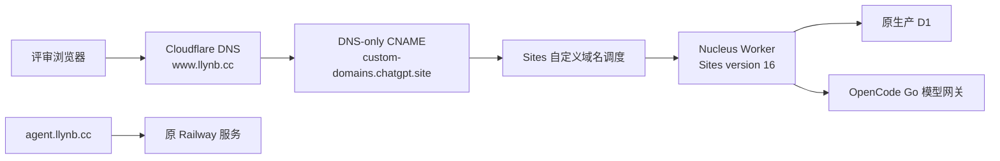

# `www.llynb.cc` 自定义域名与长期托管

> 上线状态：2026-08-09 已完成。`https://www.llynb.cc`、域名路由和 HTTPS 证书均为 active；原 Sites 地址继续作为备用入口。

本章解释这次域名是怎样落地的、为什么没有复制到 Railway、以后发布新版本要做什么，以及出现问题如何回滚。

## 1. 最终结果

- 主访问地址：<https://www.llynb.cc>
- Sites 备用地址：<https://nucleus-ai-builder-root.dreamy-joy-4746.chatgpt.site>
- 复杂看板：<https://www.llynb.cc/p/app-0bd184>
- `agent.llynb.cc`：继续指向原 Railway 项目，本次没有修改
- Nucleus 运行环境：原 Sites Worker + 原 D1 + 原环境变量
- 本地电脑：关机不会影响在线站点

“长期在线”不表示永远没有平台故障或额度限制，而是网页不依赖本机的 `pnpm dev` 进程。请求由托管平台的边缘 Worker 接收，生产数据保存在托管 D1 中。

## 2. 为什么选择绑定现有 Sites，而不是 Railway

| 方案 | 优点 | 当前项目的代价 | 结论 |
|---|---|---|---|
| 现有 Sites + 自定义域名 | 保留当前 Worker、D1、账号身份、环境变量和生产数据 | 只需域名验证与 DNS | 本次采用 |
| Railway 再部署一套 | 你已有使用经验，普通 Node 服务容易理解 | 需要重新适配 D1 binding、数据库、身份、环境变量、长连接和发布流程；会产生两套状态 | 不适合当前迁移 |
| 自己的 Cloudflare Worker | 技术栈匹配，可完全自主管理 | 需要新建 D1、Secrets、路由、迁移和认证替代方案 | 可作为以后平台独立化方案 |

`agent.llynb.cc` 的 Railway 方案本身没有错。它适合原来那个 Node 应用；Nucleus 已经稳定运行在 Sites 管理的 Cloudflare Worker 上，再套 Railway 只会增加迁移和双数据库风险。

## 3. 请求现在怎样流动



自定义域名没有复制应用，也没有建立 HTTP 反向代理。它只是把新 Host 安全路由到同一个 Sites 项目，因此旧链接、项目、版本和公开 slug 都仍然指向同一份生产数据。

## 4. 上线前发现了什么

上线前的只读检查得到：

- `llynb.cc` 的权威 NS 已是 Cloudflare；
- `www.llynb.cc` 原来是一个指向旧 Cloudflare Tunnel 的代理记录；
- 该地址返回 HTTP 530，说明旧目标已不可用；
- `agent.llynb.cc` 返回 200，并带 Railway 响应头，仍然正常；
- Nucleus Sites 地址返回 200，当前项目公开可访问。

所以本次只替换失效的 `www`，没有触碰 `agent`、`api`、`game` 或其他记录。

## 5. 实际配置步骤

### 5.1 在 Sites 申请域名

对现有 Nucleus Sites 项目添加：

```text
www.llynb.cc
```

Sites 返回：

- 子域名 CNAME 目标；
- 域名所有权 TXT；
- Cloudflare Custom Hostname TXT；
- 域名状态、上游状态和 SSL 状态。

这些值应以每次 Sites 返回的结果为准，不要从别的项目复制验证 Token。

### 5.2 在 Cloudflare DNS 配置记录

当前有效结构：

| 类型 | 名称 | 内容 | Proxy |
|---|---|---|---|
| CNAME | `www` | `custom-domains.chatgpt.site` | DNS only |
| TXT | `_openai-site-verification.www` | Sites 当次签发值 | DNS only |
| TXT | `_cf-custom-hostname.www` | Sites 当次签发值 | DNS only |

关键点：

- `www` 必须替换旧 Tunnel 目标；
- CNAME 保持 DNS only，避免 Cloudflare 先在自己的客户区终止请求，妨碍外部 SaaS 自定义主机路由/验证；
- TXT 验证记录本身不承载网站流量；
- 不要修改仍在运行的 `agent.llynb.cc` Railway CNAME；
- 不要把模型 API Key 放进 DNS。

### 5.3 等待三个状态

只有下面三个状态均完成，才算 HTTPS 生产可用：

```text
custom domain status = active
provider status      = active
ssl status           = active
```

只看到浏览器偶尔能打开，不等于证书签发已经正式完成。状态接口才是域名入网阶段的真源。

## 6. 本次生产验收证据

本次不是只看控制台绿灯，而是完成了以下验证：

| 检查 | 结果 |
|---|---|
| 公共 DNS CNAME | `www.llynb.cc -> custom-domains.chatgpt.site` |
| 两条 TXT | 公共 DNS 可解析 |
| HTTPS | 首页返回 200，证书状态 active |
| 首页 | 标题为 `Nucleus — 想法即应用`，创建入口和四个成品可见 |
| Session API | `GET /api/session` 返回 200，游客为 `authenticated: false` |
| 固定成品 | `/p/app-0bd184` 返回并加载 iframe |
| 真实交互 | 新增“验证 www.llynb.cc 长期在线”，总任务 4→5、完成率 25%→20% |
| 原 Railway 域名 | `agent.llynb.cc` 仍返回 200 |

## 7. 以后发布新版本要不要再改 DNS

不需要。正常发布流程是：

1. 在功能分支修改代码；
2. 跑 Vitest、ESLint、TypeScript、Build、Playwright；
3. Commit、Push、PR；
4. 将精确提交保存为一个 Sites Version；
5. 部署这个已保存 Version；
6. 检查 `www.llynb.cc` 的 smoke test。

自定义域名绑定的是 Sites 项目，不是某一个本地进程，也不是固定的 Git 分支。以后站点部署切换到新 Version，`www.llynb.cc` 会自动跟随生产部署，无需每次改 CNAME/TXT。

仅修改 Markdown 文档时，不必为了“看起来发布过”而重新部署运行时；GitHub 更新即可。

## 8. 排错表

| 症状 | 最可能原因 | 检查顺序 |
|---|---|---|
| HTTP 530 | 仍指向失效 Tunnel/旧源站 | Cloudflare `www` 内容、DNS 公共解析 |
| 1014/1016 | CNAME 代理方式或 SaaS 路由未完成 | DNS only、CNAME 目标、域名状态 |
| 域名 pending | TXT 漏填、名称重复、DNS 未传播 | 两条 TXT、权威 NS、状态刷新 |
| SSL initializing | 证书仍在签发或验证记录错误 | `ssl_status`、TXT、等待几分钟 |
| 首页 200、API 500 | 域名已通但 Worker/D1/环境变量异常 | Worker 日志、DB binding、环境 revision |
| 旧项目不见了 | 误部署了另一套数据库 | 确认自定义域名绑定同一个 Sites project |
| `agent` 不能访问 | 误改了 Railway 记录 | 检查 `agent` CNAME，和 `www` 分开恢复 |

## 9. 回滚

### 应用版本回滚

优先在 Sites 把生产部署切回上一成功 Version。自定义域名不需要改，回滚后会自动指向被恢复的生产版本。

### 域名回滚

如果仅自定义域名有问题：

1. 先确认 Sites 备用地址仍正常；
2. 从评审材料暂时使用备用地址；
3. 修复 CNAME/TXT 或移除 Sites custom domain；
4. 不要恢复已经返回 530 的旧 Tunnel 记录；
5. 不要删除或覆盖 `agent.llynb.cc`。

DNS 记录的 TTL 为 Auto/约 300 秒时，外部解析器可能在变更后继续缓存几分钟，这是正常的传播窗口。

## 10. 安全与运维边界

- OpenCode Key 只放 Sites 托管环境变量，不放 Git、Markdown 或 DNS；
- 曾在聊天或截图出现过的 Key 必须撤销并重建；
- Cloudflare 账号登录、验证码和密码由账号所有者本人完成；
- 自定义域名 active 不等于模型额度无限，仍需保留调用/Token/时间预算和 429；
- 保留 Sites 备用地址，便于区分“域名故障”和“应用故障”；
- 每次上线至少检查首页、`/api/session`、一个固定公开 slug 和一次核心交互。

## 11. 官方延伸阅读

- [Cloudflare DNS records](https://developers.cloudflare.com/dns/manage-dns-records/)
- [Cloudflare CNAME record behavior](https://developers.cloudflare.com/dns/manage-dns-records/reference/dns-record-types/)
- [Cloudflare for SaaS hostname validation](https://developers.cloudflare.com/cloudflare-for-platforms/cloudflare-for-saas/domain-support/hostname-validation/)
- [Cloudflare custom hostname readiness](https://developers.cloudflare.com/cloudflare-for-platforms/cloudflare-for-saas/start/common-api-calls/)
