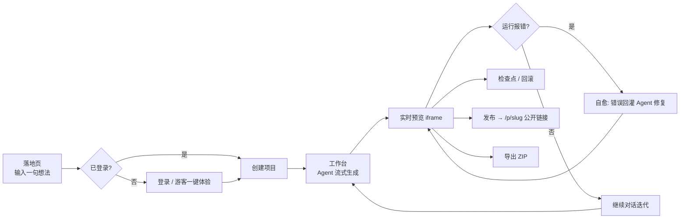
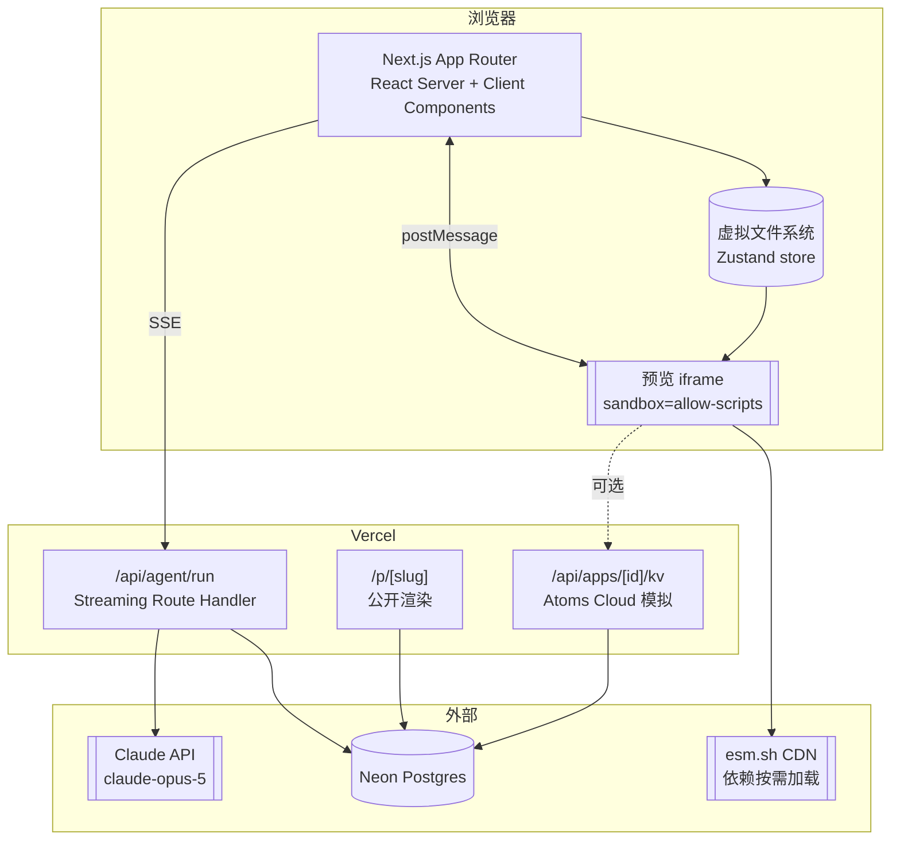
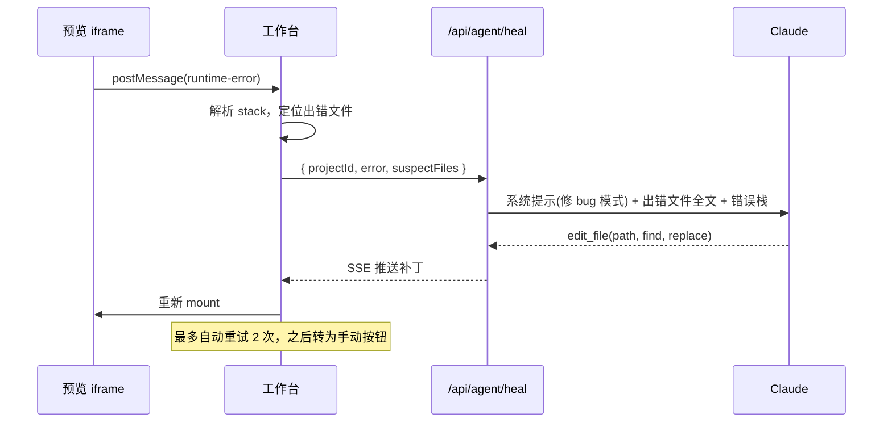

# Atoms Demo —— 项目设计文档

> ROOT AI Native 全栈工程师笔试 · 设计与架构
> 代号：**Nucleus** —— 一个由智能体驱动、把想法直接变成可运行网页应用的平台

---

## 0. 一句话结论

在 6–8 小时内交付一个 **"输入一句话 → 多智能体协作生成多文件 React 应用 → 浏览器内实时编译预览 → 一键发布公开链接"** 的可用产品原型，
并通过 **运行时自愈**、**版本检查点回滚**、**双模型竞速** 三个衍生能力体现工程深度。

**核心取舍：不做真沙箱。** 生成的应用是纯前端 React SPA，在浏览器 iframe 内用 Babel Standalone 现场转译、
用 esm.sh 按需拉取依赖执行。零容器、零 npm install、零冷启动 —— 这是本项目能在一天内落地的唯一前提。

---

## 1. 题目解读：他们到底在考什么

原题的显性要求只有五条，但每条背后都有隐含考点：

| 原文要求 | 隐含考点 | 本方案的应对 |
|---|---|---|
| 具备类似 Atoms 的能力与 UI 交互体验 | 你有没有真正用过、理解产品 | 复刻多智能体编排 + 三栏工作台 + Race Mode |
| 通过智能体驱动完成代码（应用）生成 | 会不会写 tool-calling agent loop，而不是"让 LLM 吐一段 markdown" | 强制工具调用协议（`write_file` / `edit_file` / `set_plan`），流式落盘 |
| 生成的应用以可视化网页形式展示 | 这是全场最硬的技术点 | 浏览器内 CJS 模块系统 + Babel 转译 + esm.sh CDN |
| 具备真实交互（而非纯静态展示） | 反"截图式 Demo" | 对话可持续迭代、点击可回滚、生成物可交互 |
| 具备数据持久化 | 有没有后端与数据建模能力 | Postgres：用户 / 项目 / 消息 / 版本快照 / 发布 |
| 至少一个延展或衍生能力 | 创新性得分点 | 自愈闭环 + 检查点回滚 + Race Mode + 发布分享 |

评估维度中 **"工程思维：任务拆解、技术选型、复杂度控制与取舍能力"** 权重最高。
因此本文档刻意用一整节（§7）写"**我们不做什么**"—— 主动暴露边界比堆功能更能证明判断力。

---

## 2. 产品设计

### 2.1 核心用户旅程



### 2.2 页面清单

| 路由 | 作用 | 关键设计 |
|---|---|---|
| `/` | 落地页 | 巨型 Prompt 输入框 + 4 个示例卡片（一点即生成）。**必须有"游客一键体验"** —— 评审人不会为了看你的 Demo 去注册 |
| `/login` | 登录 | GitHub OAuth + 邮箱魔法链接 + `Demo 账号` 按钮 |
| `/dashboard` | 项目列表 | 卡片网格，展示缩略信息、更新时间、发布状态 |
| `/w/[projectId]` | **工作台（主战场）** | 三栏：左 Agent 时间线 / 中 预览·代码 Tab / 右上 版本+发布+导出 |
| `/p/[slug]` | 公开发布页 | 全屏渲染生成的应用，无任何平台 UI，可直接分享 |

### 2.3 工作台布局

```
┌──────────────────────────────────────────────────────────────────────┐
│  Nucleus   项目名 ▾        [v3 检查点 ▾] [⚡Race] [导出] [发布 ⇗]     │
├────────────────────┬─────────────────────────────────────────────────┤
│  Agent 时间线      │  [ 预览 ] [ 代码 ]                   [↻] [⛶]   │
│                    │                                                 │
│  🔍 Iris  需求分析 │  ┌───────────────────────────────────────────┐  │
│     ✓ 3 个核心场景 │  │                                           │  │
│  📐 Bob   架构设计 │  │        iframe (sandbox)                   │  │
│     ✓ 7 个文件     │  │        生成的应用在这里活着                │  │
│  ⚙️ Alex  编码中…  │  │                                           │  │
│     ✓ /App.tsx     │  └───────────────────────────────────────────┘  │
│     ⣾ /TodoList.tsx│                                                 │
│                    │  ⚠ 运行时错误 → [ 让 Alex 修复 ]                │
│ ─────────────────  │                                                 │
│  💬 输入修改要求…  │                                                 │
└────────────────────┴─────────────────────────────────────────────────┘
```

左栏不是普通聊天框，而是 **Agent 事件时间线**：每个智能体有名字、头像、状态（思考中 / 执行中 / 完成），
文件逐个"长"出来。这是 Atoms 体验的灵魂 —— 用户看到的是一个团队在干活，不是一个 loading spinner。

---

## 3. 技术架构

### 3.1 总览



### 3.2 技术选型

| 层 | 选型 | 为什么是它 |
|---|---|---|
| 框架 | **Next.js 15 App Router + TypeScript** | 前后端同仓、Route Handler 原生支持流式响应、Vercel 零配置部署 |
| UI | **Tailwind CSS + shadcn/ui** | 6 小时内做出"不像 Demo"的界面，唯一现实解 |
| 状态 | **Zustand** | 虚拟文件系统是高频写入的可变状态，Zustand 比 Context 省心一个量级 |
| 数据库 | **Neon Postgres（Serverless）** | Vercel 一键集成，免费额度足够；快照存 JSONB，无需文件表 |
| ORM | **Drizzle** | schema 即 TS、`drizzle-kit push` 秒级建表，比 Prisma 少一个 generate 步骤 |
| 认证 | **Auth.js v5** | GitHub OAuth 约 20 行；同时暴露 Credentials provider 做 Demo 账号 |
| LLM | **Claude API（`@anthropic-ai/sdk`）** | 见 §4.1 |
| 转译 | **@babel/standalone**（在 iframe 内，CDN 引入） | 支持 TSX + JSX automatic runtime，浏览器内唯一开箱即用的选择 |
| 依赖 | **esm.sh** | 任意 npm 包按需 ESM 化，无需预先枚举 |
| 部署 | **Vercel**（备选 Zeabur / Cloudflare Pages） | 免费、快、有公开域名 |

### 3.3 模型选型与成本

以当前 Claude 定价（每百万 token）为准：

| 模型 | 模型 ID | 输入 | 输出 | 定位 |
|---|---|---|---|---|
| Claude Opus 5 | `claude-opus-5` | $5 | $25 | **主力生成模型**，代码质量最高 |
| Claude Sonnet 5 | `claude-sonnet-5` | $3（2026-08-31 前 $2） | $15（限时 $10） | Race Mode 对照组 / 成本敏感时降级 |
| Claude Haiku 4.5 | `claude-haiku-4-5` | $1 | $5 | 错误摘要、标题生成等辅助小任务 |

**单次成本估算**：一次完整生成约 2k 输入 + 8~12k 输出 token ≈ **$0.2–0.3**（Opus 5）；
后续单文件增量修改约 $0.05。开发 + 演示全程预算 **$15–30** 足够。

> 加分项提示：题目末尾写明"可附上 AI coding 工具使用/充值账单作为加分"。
> 建议在提交文档里附 Claude Code / Cursor 的账单截图，以及本项目自身的 API 用量截图。

---

## 4. 核心模块详设

### 4.1 Agent 编排层

#### 设计原则

**不要让模型输出 Markdown 代码块然后正则去解析。** 这是所有 vibe-coding demo 翻车的头号原因。
正确做法是**强制工具调用**：模型每写一个文件就是一次 `write_file` 工具调用，服务端逐次落盘 + 推流。

#### 多智能体角色（对齐 Atoms 的团队叙事）

| 智能体 | 职责 | 实现 | 模型 |
|---|---|---|---|
| **Iris** 需求分析 | 把一句话扩写成产品要点 | 一次结构化输出调用 | `claude-opus-5` |
| **Bob** 架构师 | 定文件树 + 数据模型 | 调用 `set_plan` 工具 | `claude-opus-5` |
| **Alex** 工程师 | 逐文件写代码 | 多轮 `write_file` / `edit_file` | `claude-opus-5` |
| **Ray** 质检 | 消费运行时错误并修补 | `edit_file`，最多 2 轮 | `claude-opus-5` |

前三个可以合并进**同一条 agent loop**（一次请求内按阶段推进），避免多次往返带来的延迟和上下文重建成本。
Ray 是独立触发的（由 iframe 报错驱动）。

#### 工具定义（示意）

```ts
// lib/agent/tools.ts
export const tools = [
  {
    name: "set_plan",
    description: "在开始写代码前，先输出产品规划与文件树。必须最先调用一次。",
    input_schema: {
      type: "object",
      properties: {
        appName:  { type: "string" },
        summary:  { type: "string", description: "一句话产品定位" },
        features: { type: "array", items: { type: "string" } },
        files:    { type: "array", items: { type: "string" }, description: "计划创建的文件路径" },
      },
      required: ["appName", "summary", "features", "files"],
    },
  },
  {
    name: "write_file",
    description: "创建或整体覆盖一个文件。路径以 / 开头，如 /App.tsx。",
    input_schema: {
      type: "object",
      properties: {
        path:    { type: "string" },
        content: { type: "string" },
      },
      required: ["path", "content"],
      additionalProperties: false,
    },
    // 关键：开启细粒度工具流式输出，让 content 边生成边推给前端
    eager_input_streaming: true,
  },
  {
    name: "edit_file",
    description: "对已有文件做精确字符串替换，用于小改动，比重写整个文件更快更省。",
    input_schema: {
      type: "object",
      properties: {
        path:    { type: "string" },
        find:    { type: "string", description: "要被替换的原文，必须唯一匹配" },
        replace: { type: "string" },
      },
      required: ["path", "find", "replace"],
      additionalProperties: false,
    },
  },
  { name: "finish", description: "全部文件写完后调用，附一段面向用户的总结。",
    input_schema: { type: "object", properties: { notes: { type: "string" } }, required: ["notes"] } },
] as const;
```

> `eager_input_streaming: true` 是本设计的一个关键细节：它让 `write_file` 的 `content`
> 参数以 `input_json_delta` 形式增量到达，从而实现**代码逐字符"打字机"效果**。
> 这不是 beta 特性，直接用常规 `client.messages.stream(...)` 即可。

#### Agent Loop（服务端，示意）

```ts
// app/api/agent/run/route.ts
import Anthropic from "@anthropic-ai/sdk";

export const maxDuration = 300; // Vercel: 争取更长执行时间

const client = new Anthropic();

export async function POST(req: Request) {
  const { projectId, prompt, model = "claude-opus-5" } = await req.json();
  const encoder = new TextEncoder();

  const readable = new ReadableStream({
    async start(controller) {
      const emit = (e: AgentEvent) =>
        controller.enqueue(encoder.encode(`data: ${JSON.stringify(e)}\n\n`));

      let messages = await loadHistory(projectId, prompt);

      for (let step = 0; step < 16; step++) {
        const stream = client.messages.stream({
          model,
          max_tokens: 64000,
          // 系统提示 + 工具定义放在最前且打缓存断点：后续每一轮都命中缓存
          system: [{ type: "text", text: SYSTEM_PROMPT, cache_control: { type: "ephemeral" } }],
          thinking: { type: "adaptive" },
          output_config: { effort: "high" },
          tools,
          messages,
        });

        // 增量推送：文件内容边生成边显示
        for await (const ev of stream) {
          if (ev.type === "content_block_start" && ev.content_block.type === "tool_use") {
            emit({ t: "tool_start", id: ev.content_block.id, name: ev.content_block.name });
          }
          if (ev.type === "content_block_delta" && ev.delta.type === "input_json_delta") {
            emit({ t: "tool_delta", chunk: ev.delta.partial_json });
          }
          if (ev.type === "content_block_delta" && ev.delta.type === "text_delta") {
            emit({ t: "text", chunk: ev.delta.text });
          }
        }

        const msg = await stream.finalMessage();
        messages.push({ role: "assistant", content: msg.content });

        if (msg.stop_reason === "end_turn") break;
        if (msg.stop_reason === "pause_turn") continue; // 服务端工具暂停，直接续跑

        // 执行工具：落库 + 推送最终态
        const results = [];
        for (const b of msg.content) {
          if (b.type !== "tool_use") continue;
          const out = await applyTool(projectId, b.name, b.input, emit);
          results.push({ type: "tool_result", tool_use_id: b.id, content: out });
        }
        if (results.length === 0) break;
        messages.push({ role: "user", content: results });

        if (msg.content.some(b => b.type === "tool_use" && b.name === "finish")) break;
      }

      emit({ t: "done" });
      controller.close();
    },
  });

  return new Response(readable, {
    headers: { "Content-Type": "text/event-stream", "Cache-Control": "no-cache" },
  });
}
```

**两个必须注意的 API 细节**（否则直接 400）：

- `claude-opus-5` **不接受** `temperature` / `top_p` / `top_k`，传了就报错。用提示词控制风格。
- `claude-opus-5` **默认开启思考**。`max_tokens` 是"思考 + 输出"的总上限，所以要给足（建议 64000，
  流式下最高 128000）。想关闭思考需 `thinking: {type:"disabled"}`，且 `effort` 不能超过 `high`。

#### 提示词缓存（成本优化）

系统提示 + 工具定义约 2–3k token，每一轮 loop 都会重发。在 system 最后一块打
`cache_control: {type: "ephemeral"}`，缓存命中价约为原价的 0.1×。
`claude-opus-5` 的最小可缓存前缀是 **512 token**，我们的系统提示远超这个门槛。

> 注意缓存是**前缀精确匹配**：系统提示里不要插入时间戳、项目 ID 等每次都变的内容，
> 否则整个缓存失效。动态上下文一律放在 `messages` 里。

---

### 4.2 预览运行时（最高风险模块 —— 请第一个做）

#### 为什么不用其他方案

| 方案 | 结论 |
|---|---|
| Docker / E2B / Firecracker 沙箱 | 保真度最高，但需要容器编排 + 冷启动优化，8 小时内做不完。**放弃** |
| WebContainer（StackBlitz） | 效果最好，但需要 COOP/COEP 跨域隔离头，且商用需授权。**放弃** |
| 单文件 HTML + Tailwind CDN | 最稳但太"玩具"，展示不出工程能力。**作为兜底降级路径保留** |
| ✅ **虚拟 FS + 浏览器内 CJS 模块系统 + esm.sh** | 多文件、真编译、零基建。**选它** |

#### 架构

```
父页面                              iframe (sandbox="allow-scripts")
  │                                    │
  │  postMessage({type:'mount',        │
  │               files, entry})       │
  ├───────────────────────────────────▶│
  │                                    │  1. 扫描所有裸包 import
  │                                    │  2. await import('https://esm.sh/xxx') 预加载
  │                                    │  3. Babel 转译 TSX → CJS
  │                                    │  4. 自建 require() 同步求值（支持循环依赖）
  │                                    │  5. ReactDOM.createRoot().render()
  │  ◀─────────────────────────────────┤
  │  postMessage({type:'runtime-error',│
  │               message, stack})     │
  ▼                                    ▼
自愈闭环                            应用跑起来了
```

#### 核心实现（iframe 内，约 80 行）

```html
<!-- app/preview-runtime/page.tsx 输出的 srcdoc 骨架 -->
<script src="https://cdn.tailwindcss.com"></script>
<script src="https://unpkg.com/@babel/standalone@7/babel.min.js"></script>
<div id="root"></div>
<script>
const files = {};      // path -> 源码
const registry = {};   // path -> module.exports（同时用于打破循环依赖）
const bare = {};       // 'react' -> ESM namespace

// 关键：react 系列必须锁定同一实例，其余包全部 external 掉 react
const PINNED = {
  'react':            'https://esm.sh/react@18.3.1',
  'react-dom':        'https://esm.sh/react-dom@18.3.1?external=react',
  'react-dom/client': 'https://esm.sh/react-dom@18.3.1/client?external=react',
  'react/jsx-runtime':'https://esm.sh/react@18.3.1/jsx-runtime',
};
const cdn = s => PINNED[s] ?? `https://esm.sh/${s}?external=react,react-dom`;

// 相对路径归一化 + 扩展名补全
function resolve(from, spec) {
  if (!spec.startsWith('.')) return spec;
  const seg = from.split('/').slice(0, -1);
  for (const p of spec.split('/')) {
    if (p === '' || p === '.') continue;
    p === '..' ? seg.pop() : seg.push(p);
  }
  const base = '/' + seg.join('/');
  const cands = [base, base+'.tsx', base+'.ts', base+'.jsx', base+'.js',
                 base+'/index.tsx', base+'/index.ts'];
  return cands.find(c => c in files) ?? base;
}

function require_(path) {
  if (path in registry) return registry[path];        // 循环依赖在这里被截断
  if (!(path in files)) {
    if (path in bare) return bare[path];
    throw new Error('Module not found: ' + path);
  }
  const mod = { exports: {} };
  registry[path] = mod.exports;                       // 先登记再求值
  const { code } = Babel.transform(files[path], {
    filename: path,
    presets: [['react', { runtime: 'automatic' }], 'typescript'],
    plugins: ['transform-modules-commonjs'],
  });
  new Function('require', 'module', 'exports', code)(
    spec => require_(resolve(path, spec)), mod, mod.exports
  );
  registry[path] = mod.exports;
  return mod.exports;
}

async function mount(fileMap, entry) {
  Object.keys(files).forEach(k => delete files[k]);
  Object.keys(registry).forEach(k => delete registry[k]);
  Object.assign(files, fileMap);

  // 预加载所有裸包，之后 require 就可以是同步的
  const specs = new Set(Object.keys(PINNED));
  for (const src of Object.values(files))
    for (const m of src.matchAll(/from\s+['"]([^.'"][^'"]*)['"]/g)) specs.add(m[1]);
  await Promise.all([...specs].map(async s => { bare[s] = await import(cdn(s)); }));

  const React = bare['react'];
  const { createRoot } = bare['react-dom/client'];
  const App = require_(entry).default;
  createRoot(document.getElementById('root')).render(React.createElement(App));
}

window.addEventListener('message', e => {
  if (e.data?.type === 'mount')
    mount(e.data.files, e.data.entry || '/App.tsx')
      .catch(err => report(err.message, err.stack));
});
const report = (message, stack) =>
  parent.postMessage({ type: 'runtime-error', message, stack }, '*');
window.onerror = (m, s, l, c, err) => report(String(m), err?.stack);
window.addEventListener('unhandledrejection', e => report(String(e.reason), e.reason?.stack));
</script>
```

#### 三个必须提前知道的坑

1. **`sandbox` 不能加 `allow-same-origin`**（否则生成的代码能访问父页面的 cookie / localStorage）。
   代价是 iframe 处于 opaque origin，**`localStorage` 会抛异常**。
   → 在 runtime 里注入一个内存版 `localStorage` polyfill；进阶版通过 postMessage 落到后端 KV（见 §4.6）。

2. **React 实例必须唯一**。所有第三方包走 `?external=react,react-dom`，否则会出现
   "Invalid hook call / 两个 React 副本" 的经典错误。

3. **Babel Standalone 约 3MB**。首次加载慢，可在工作台挂载时就预热 iframe（空白挂载一次）。

#### 降级路径

如果 CJS 模块系统在联调时出问题，立即降级到"**单文件模式**"：
系统提示改为只允许生成一个 `/App.tsx`，`mount` 直接转译单文件执行。
功能打折但绝不会白屏。**这条降级路径必须在开工前就写进提示词模板里，随时可切换。**

---

### 4.3 自愈闭环（衍生能力 ①）

这是全项目性价比最高的功能：**约 40 分钟，直接命中"创新性"评分**。



**必须做的三个约束**：

- **最多 2 次自动重试**，否则模型会陷入"改坏→再改→更坏"的死循环，还烧钱。
- 只把**可疑文件**（栈里出现的 + 入口文件）喂进去，不要全量文件，控制 token。
- UI 上要**明确展示**"检测到错误 → Ray 正在修复 → 已修复"，这个过程本身就是演示亮点。

---

### 4.4 版本检查点与回滚（衍生能力 ②）

每次 Agent 运行结束后，把当前虚拟文件系统整体快照进 `versions` 表（JSONB）。

- 工作台右上角一个版本下拉，选中即回滚（本质是 `mount(snapshot.files)` + 写回当前版本指针）。
- 提供 **diff 视图**（用 `diff` 包做行级对比），展示每个版本改了哪些文件。
- 快照存全量而非增量 —— 单项目文件总量 < 100KB，全量存储换来的是零复杂度。**这是有意识的取舍。**

这个功能同时解决了"数据持久化"的硬性要求，一箭双雕。

---

### 4.5 Race Mode 双模型竞速（衍生能力 ③）

**直接复刻 Atoms 的真实功能，评审人一眼就能认出来。**

同一个 Prompt 并发跑 `claude-opus-5` 与 `claude-sonnet-5`，左右两个预览 iframe 同时渲染，
底部显示各自的耗时 / token 数 / 预估成本，用户点"采用这个"决定进入哪条分支。

实现成本很低：两条独立的 SSE 流 + 两套虚拟 FS state + 两个 iframe。约 45 分钟。

---

### 4.6 Atoms Cloud 模拟（可选，加分项）

Atoms 卖点之一是"每个生成的应用自带数据库"。可以用极小的成本模拟：

在 runtime 内注入全局对象：

```ts
window.atoms = {
  db: {
    get:  (k)    => callParent('kv:get',  { k }),
    set:  (k, v) => callParent('kv:set',  { k, v }),
    list: (pfx)  => callParent('kv:list', { pfx }),
  }
};
```

父页面收到 postMessage 后转发到 `/api/apps/[projectId]/kv`，落 Postgres。
这样**生成的应用自己也有了持久化**，而不只是平台有 —— 演示效果极强。

约 45 分钟，列为 P2（时间够就做）。

---

### 4.7 发布与分享

`/p/[slug]` 是一个 Server Component：从数据库读出该项目当前版本的文件快照，
渲染同一套 runtime shell，全屏无平台 UI。

- 发布时生成短 slug（`nanoid(8)`）
- 页面加 `noindex`（生成内容不应被搜索引擎收录）
- 这就是提交时"可测试的在线访问链接"的最佳形态：评审人点开就是一个能用的 App

---

## 5. 数据模型

```ts
// db/schema.ts (Drizzle)
export const users = pgTable("users", {
  id:        text("id").primaryKey(),
  email:     text("email").notNull().unique(),
  name:      text("name"),
  image:     text("image"),
  isGuest:   boolean("is_guest").default(false),
  createdAt: timestamp("created_at").defaultNow(),
});

export const projects = pgTable("projects", {
  id:               text("id").primaryKey(),
  userId:           text("user_id").notNull().references(() => users.id),
  name:             text("name").notNull(),
  slug:             text("slug").unique(),               // 发布后才有
  initialPrompt:    text("initial_prompt").notNull(),
  status:           text("status").notNull().default("draft"), // draft|generating|ready|error
  currentVersionId: text("current_version_id"),
  publishedAt:      timestamp("published_at"),
  createdAt:        timestamp("created_at").defaultNow(),
  updatedAt:        timestamp("updated_at").defaultNow(),
});

// Agent 事件流（用户消息 + 智能体动作，统一时间线）
export const messages = pgTable("messages", {
  id:        text("id").primaryKey(),
  projectId: text("project_id").notNull().references(() => projects.id, { onDelete: "cascade" }),
  role:      text("role").notNull(),        // user | agent | system
  agent:     text("agent"),                 // iris | bob | alex | ray
  content:   jsonb("content").notNull(),    // 文本 / 工具调用 / 计划卡片
  createdAt: timestamp("created_at").defaultNow(),
});

// 版本快照：整棵文件树存 JSONB
export const versions = pgTable("versions", {
  id:        text("id").primaryKey(),
  projectId: text("project_id").notNull().references(() => projects.id, { onDelete: "cascade" }),
  parentId:  text("parent_id"),
  label:     text("label"),                              // "初始生成" / "添加深色模式"
  files:     jsonb("files").$type<Record<string,string>>().notNull(),
  model:     text("model"),                              // 哪个模型生成的（Race Mode 用）
  usage:     jsonb("usage").$type<{ in: number; out: number; ms: number }>(),
  createdAt: timestamp("created_at").defaultNow(),
});

// 可选：生成的应用自己的数据
export const appKv = pgTable("app_kv", {
  projectId: text("project_id").notNull(),
  key:       text("key").notNull(),
  value:     jsonb("value"),
  updatedAt: timestamp("updated_at").defaultNow(),
}, t => ({ pk: primaryKey({ columns: [t.projectId, t.key] }) }));
```

**取舍说明**：不建 `files` 表。文件树整体存 JSONB 快照，牺牲了细粒度查询能力，
换来的是"版本回滚"变成一行代码。在当前数据规模下（单项目 < 100KB）这是明显正确的选择。

---

## 6. 流式事件协议

前后端约定一套扁平事件，SSE 传输：

```ts
type AgentEvent =
  | { t: "agent";      agent: "iris"|"bob"|"alex"|"ray"; status: "start"|"done" }
  | { t: "plan";       appName: string; summary: string; features: string[]; files: string[] }
  | { t: "text";       chunk: string }
  | { t: "file_start"; path: string }
  | { t: "file_delta"; path: string; chunk: string }   // 打字机效果
  | { t: "file_done";  path: string }
  | { t: "version";    versionId: string; label: string }
  | { t: "usage";      inputTokens: number; outputTokens: number; ms: number }
  | { t: "error";      message: string }
  | { t: "done" };
```

前端一个 reducer 消费全部事件，同时更新「时间线」与「虚拟文件系统」两份状态。
`file_done` 触发 iframe 重新 mount（做 300ms 防抖，避免多文件连续写入时疯狂重挂）。

---

## 7. 明确不做的事（复杂度控制）

这一节请**原样写进提交说明文档** —— 它是"工程思维"这一项最直接的证据。

| 不做 | 理由 |
|---|---|
| 真容器沙箱 / npm install | 需要容器编排 + 冷启动优化，与 8 小时窗口不匹配。用浏览器内编译换 95% 的体验 |
| 生成带后端的全栈应用 | 生成物只做前端 SPA。后端生成需要部署编排，是一个数量级更大的工程 |
| 每个应用独立子域名部署 | 用 `/p/[slug]` 路由代替，效果等价，成本为零 |
| 可视化拖拽编辑器 | Atoms 有，但独立做至少 2 天。用「选中元素 → 自然语言修改」的思路更符合 AI Native |
| 多人协作 / 实时同步 | 需要 CRDT 或 OT，与考察点无关 |
| 计费 / 配额 / 团队管理 | 与考察点无关 |
| 自建代码编辑器 | 用只读的 Shiki 高亮展示。可编辑代码是伪需求 —— 用户来这里是为了不写代码 |

---

## 8. 风险清单与预案

| # | 风险 | 概率 | 影响 | 预案 |
|---|---|---|---|---|
| R1 | 浏览器内模块系统调不通（循环依赖 / 解析错误） | 中 | **致命** | **第一个做，用硬编码文件树先跑通再接 LLM**；降级到单文件模式 |
| R2 | Vercel 函数执行超时（生成耗时 > 限额） | 中 | 高 | 设 `maxDuration = 300`；每个 `write_file` 立即落库（中断也不丢进度）；提供"继续生成"按钮 |
| R3 | 模型生成的代码引用了 esm.sh 上不存在的包 | 中 | 中 | 系统提示中给出**依赖白名单**（react / lucide-react / recharts / clsx / date-fns），并在 `write_file` 时做静态校验 |
| R4 | 国内本地开发访问 Claude API 受限 | 高 | 中 | 本地用代理；**部署在 Vercel（美国出口）不受影响**。提前验证线上链路 |
| R5 | 自愈循环反复失败，烧钱 | 中 | 中 | 硬性上限 2 次；超出转手动按钮 |
| R6 | Tailwind Play CDN 在 iframe 内首屏闪烁 | 高 | 低 | 挂载前先隐藏 `#root`，样式就绪后再显示 |
| R7 | 演示时 API key 被滥用 | 低 | 中 | 游客账号加速率限制（IP 维度，每小时 3 次生成） |

**R1 是唯一可能导致项目失败的风险，因此排期上必须最先做。**

---

## 9. 评分维度对照表

| 评分维度 | 本方案的对应交付物 |
|---|---|
| **完成度** —— 功能完整性、稳定性、工程质量 | 注册/登录 → 生成 → 预览 → 迭代 → 发布 全链路闭环；TypeScript 全覆盖；错误边界与降级路径 |
| **工程思维** —— 拆解、选型、复杂度控制、取舍 | §3.2 选型表逐项给理由；§7 不做清单；§8 风险预案；§4.2 三方案对比后选一 |
| **用户体验** —— 交互清晰、流程顺畅、可用 | Agent 时间线（不是 spinner）；代码打字机效果；游客一键体验；自愈过程可见 |
| **创新性** —— 亮点、独特视角、扩展潜力 | 自愈闭环 / Race Mode / Atoms Cloud KV 模拟 / 检查点回滚 |
| **可交付性** —— 文档、可运行、完成质量 | 本文档 + README + 60 秒演示视频 + 线上链接 + 公开仓库 + API 账单截图 |

---

## 10. 验收清单（提交前逐条打勾）

**功能**
- [ ] 未登录访问首页，点击示例卡片能直接进入生成流程（游客态）
- [ ] 邮箱/GitHub 注册登录正常，登录后能看到自己的项目列表
- [ ] 输入一句话，能看到 Iris→Bob→Alex 依次工作的时间线
- [ ] 文件逐个出现，代码有打字机效果
- [ ] 预览 iframe 正确渲染，生成的应用可点击、可交互
- [ ] 追加一句"加个深色模式"，能正确增量修改并重新渲染
- [ ] 故意制造一个报错，自愈流程能触发并修复
- [ ] 版本下拉能回滚到上一个检查点
- [ ] 发布后 `/p/xxx` 无痕浏览器可访问
- [ ] 导出 ZIP 能下载，解压后结构正确
- [ ] 刷新页面，项目、消息、文件全部还在（持久化验证）

**工程**
- [ ] 无 TypeScript 错误，`next build` 通过
- [ ] API key 只在服务端使用，未泄漏到客户端 bundle
- [ ] 生成 iframe 使用 `sandbox` 且不含 `allow-same-origin`
- [ ] 游客生成有速率限制
- [ ] README 含本地启动步骤与环境变量说明

**交付**
- [ ] GitHub 仓库 Public
- [ ] 线上链接可访问，且预置了 2–3 个 Demo 项目供直接查看
- [ ] 提交说明文档：实现思路 / 关键取舍 / 完成度 / 后续规划优先级
- [ ] 附 AI coding 工具账单截图（加分项）
