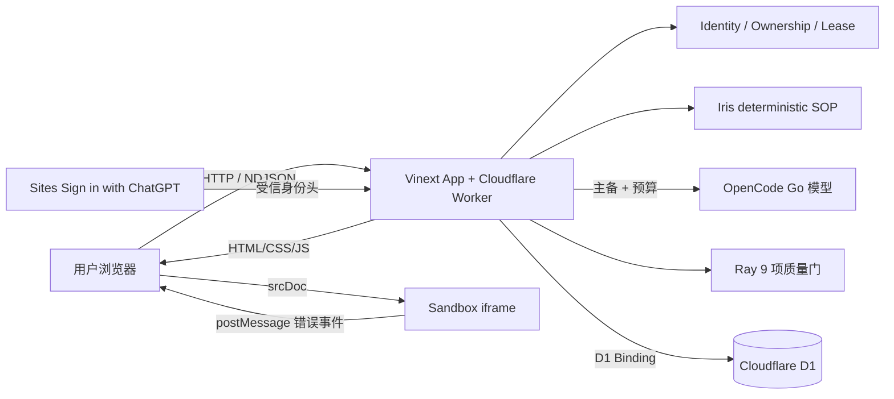
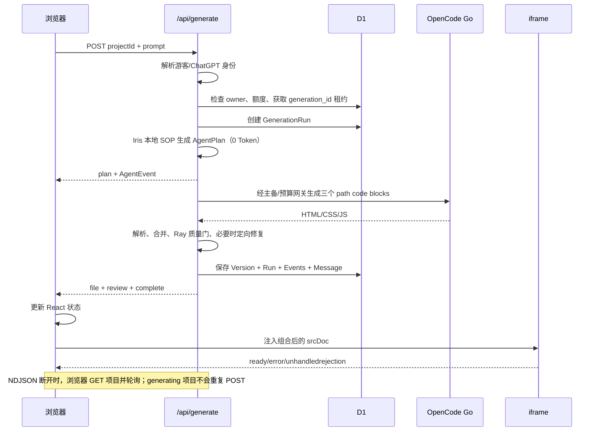

# 02. 系统架构

## 1. 一张图看懂系统



这里没有单独购买一台服务器。前端页面、API 路由和 Worker 一起构建并部署；D1 通过运行时绑定注入；模型 API Key 也只存在于服务端环境。

## 2. 一次生成的完整时序



## 3. 各层职责

| 层 | 关键文件 | 只负责什么 |
|---|---|---|
| 页面路由 | `app/page.tsx`、`app/w/[id]/page.tsx` | 页面入口和路由参数 |
| 交互组件 | `components/workbench.tsx` | 状态、流解析、按钮行为 |
| API | `app/api/**/route.ts` | 校验请求、编排服务、返回响应 |
| 身份 | `lib/session.ts`、`lib/identity.ts`、`app/chatgpt-auth.ts` | visitor Cookie、受信账号、迁移、owner |
| 规划 | `lib/planner.ts` | 本地确定性 Iris SOP |
| 模型网关 | `lib/model-gateway.ts` | 主备、超时、取消、调用/Token/时间预算 |
| AI 构建 | `lib/opencode.ts` | Alex Prompt、漏文件和 Ray 定向修复 |
| 解析/质量/运行时 | `lib/parser.ts`、`lib/quality.ts`、`lib/runtime.ts` | 文件协议、9 项质量门、iframe 组装与启动桥 |
| 数据 | `lib/db.ts`、`db/schema.ts` | 所有权、租约、快照、固定发布、审计、限流 |
| 平台入口 | `worker/index.ts` | Worker fetch 与图片优化 |
| 构建部署 | `vite.config.ts`、`.openai/hosting.json` | Worker、D1 和部署元数据 |

职责分开非常重要。例如 API 路由不应该自己写一大段 SQL，组件也不应该直接拿 API Key 调模型。

## 4. 为什么使用 Vinext + Worker

项目页面写法沿用 Next App Router 的开发体验，但最终通过 Vinext 和 Vite 构建为 Cloudflare Worker 可运行的产物。这样可以同时获得：

- React 服务端/客户端路由结构；
- 同仓库 API 路由；
- Cloudflare 的边缘运行时和 D1 binding；
- 一次部署交付前端、后端和静态资源。

`vite.config.ts` 中的三个主要插件：

```ts
plugins: [
  vinext(),
  sites(),
  cloudflare({ /* Worker 和 D1 配置 */ }),
]
```

- `vinext()`：把 App Router 项目转换成 Vite/Worker 构建；
- `sites()`：把 hosting 配置和 migration 复制进部署产物；
- `cloudflare()`：让本地开发和生产构建使用 Workers 运行时与绑定。

## 5. Worker 入口做了什么

`worker/index.ts` 导出一个带 `fetch` 的对象：

- 图片优化路径 `/_vinext/image` 交给图片处理逻辑；
- 其他请求全部交给 Vinext 的 App Router handler；
- `env.DB` 是平台注入的 D1 数据库；
- `env.ASSETS` 是平台注入的静态资源读取器。

可以把 Worker 理解为云端的 `main()`：每个 HTTP 请求都从 `fetch(request, env, ctx)` 进入。

## 6. 三种数据流不要混淆

### 普通 JSON

例如创建项目：浏览器 POST，服务端一次性返回完整 JSON。

### NDJSON 流

生成过程持续返回多行 JSON，每一行是一个独立事件。浏览器收到一行就更新一次 UI，不必等模型全部结束。

### iframe 消息

生成应用运行在另一个浏览上下文。它通过 `window.parent.postMessage()` 把运行错误告诉工作台，不走服务端。

## 7. 数据真源

- D1：项目、版本、消息、运行、Agent 事件和限流的真源；
- Sites 身份头：登录账号事实；HttpOnly visitor Cookie：未登录工作区事实；
- React state：当前页面的临时视图；
- iframe 内存：生成应用本次预览的临时状态；
- Git/GitHub：Nucleus 自身源代码的版本真源。

把四者混为一谈是初学者最常见的问题。刷新页面会清空 React state，但项目仍可从 D1 重新读取；切换 Git 分支不会修改线上 D1 数据。

## 8. 关键架构取舍

| 决策 | 收益 | 代价 |
|---|---|---|
| 三文件生成物 | 快、可导出、易隔离 | 不能生成完整后端 |
| 确定性 Iris + 一次代码模型 | 保留计划工件，0 规划 Token，降低长连接风险 | 规划能力受规则边界限制 |
| 全量版本快照 | 恢复简单可靠 | 比差量存储占空间 |
| NDJSON | 实现轻、浏览器原生可读 | 不支持双向通信 |
| D1 直接 prepared statement | Worker 运行简单清楚 | 复杂查询时抽象较薄 |
| sandbox iframe | 明确隔离生成代码 | localStorage 等能力受限 |

## 9. 一致性为什么比“多 Agent 头像”更重要

四个 Agent 的价值来自可检查工件，而不是 UI 动画：

| 角色 | 真实工件 |
|---|---|
| Iris | `AgentPlan` 和 requirements AgentEvent |
| Bob | architecture AgentEvent 和三文件约束 |
| Alex | 三个文件、模型用量和 implementation 事件 |
| Ray | `AppQualityReport`、修复次数、最终终态 |

每轮运行用 `generation_id`/run ID 串联。终止后，旧写者不能继续新增事件、修改项目或创建 Version。这是 MetaGPT SOP 思想在当前 Worker 范围内的落地边界。
