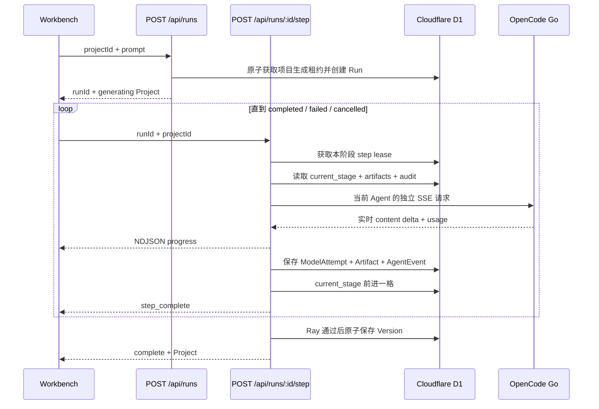

# 04. 可恢复的真实多 Agent 生成链路

最后更新：2026-08-10

## 1. 现在的结论

当前主链路不再是“一次大模型请求假装四个 Agent”，也不再要求一个 HTTP 长连接承担整轮生成。每个角色都调用真实模型、产生独立工件，并在进入下一阶段前写入 D1：

1. Iris 生成需求契约；
2. Bob 生成架构与测试策略；
3. Alex 分三次生成 `index.html`、`styles.css`、`script.js`；
4. Ray 同时执行确定性检查和模型代码审查；
5. Ray 发现阻断问题时，最多进行两轮定向修复并重新审查；
6. 只有最后一次审查通过，系统才原子保存 Version。

每个阶段是独立、最长约 54 秒的请求。浏览器、网络或托管平台中断时，已经完成的工件不会丢；重新打开项目会从 `current_stage` 和已保存工件继续。

## 2. 完整时序



这里有两层流：

- 模型供应商到 Worker：OpenAI-compatible SSE；
- Worker 到浏览器：一行一个 JSON 对象的 NDJSON。

因此左栏看到的字符数、模型名和输出尾部来自真实供应商分片，不是计时器伪造的动画。

## 3. 五个核心 API 动作

### 3.1 创建项目

`POST /api/projects` 只创建 `draft` 项目，不自动花模型额度。v0 工作台明确显示“还没有生成应用”，不会拿历史 Todo Demo 冒充本次需求。

### 3.2 显式启动 Run

`POST /api/runs`：

- 验证当前 owner 是否拥有项目；
- 验证 prompt 长度；
- 原子获取项目级 generation lease；
- 创建 `generation_runs` 记录；
- 执行每小时额度保护；
- 返回 `runId`，但不在这个短请求里调用模型。

### 3.3 执行一个阶段

`POST /api/runs/:id/step` 一次只做一个可落盘阶段。路由通过 `active_step` 获取原子 step lease，避免页面双击、重连或两个标签同时执行同一阶段。

### 3.4 同步 Project

每个阶段完成后，前端重新读取 `/api/projects/:id`。这不是多余请求：D1 才是事实来源，浏览器局部状态只是视图缓存。

### 3.5 完成、失败或取消

- 完成：Version、Project 当前文件、assistant message 和 Run 终态一起提交；
- 失败：保留历史 Version 和本轮全部检查点；
- 取消：AbortSignal 中止正在进行的模型请求，项目回到 `draft` 或已有版本的 `ready`。

## 4. 每个 Agent 真正做什么

### Iris：需求工程

输入：原始需求，以及迭代时的已有版本信息。

输出 `requirements` JSON 工件：

```json
{
  "appName": "响应式贪吃蛇",
  "summary": "可键盘和触控操作的经典游戏",
  "archetype": "browser-game",
  "features": ["方向控制", "食物与增长", "计分", "暂停", "重新开始"],
  "acceptanceCriteria": ["撞墙后进入 game over", "重新开始会重置分数"],
  "risks": ["反向移动导致自身碰撞判断错误"],
  "design": "高对比游戏面板",
  "testPlan": ["连续改变方向时不能立即反向", "手机方向键可用"]
}
```

这一步解决的是“到底要做什么、怎样算完成”，不是直接写代码。

### Bob：架构设计

输入：原始需求 + Iris 工件。

输出 `architecture` JSON 工件，包括：

- 信息架构；
- 状态模型；
- 交互状态迁移；
- 三个文件各自职责；
- 可执行测试策略；
- 响应式和视觉方向。

Bob 的价值是让 Alex 不必边写代码边重新猜产品状态。例如贪吃蛇会先明确 `idle / running / paused / gameOver`，再实现计时循环与输入。

### Alex：逐文件实现

Alex 不再一次返回三份长代码。每个文件是独立阶段：

1. `implementation:index.html`；
2. `implementation:styles.css`；
3. `implementation:script.js`。

每完成一个文件就写入 `generation_artifacts`。生成 CSS 时会看到 HTML；生成 JS 时会看到 HTML 和 CSS；迭代旧项目时还会看到当前 Version，用于保留用户未要求删除的行为。

输出仍使用带白名单路径的 code fence，例如：

````text
```js{path=script.js}
// 完整 JavaScript
```
````

解析器只接受三个文件名，单文件最大 120KB。模型不能通过 `../../` 写入仓库或 Worker 文件系统。

### Ray：审查、修复和放行

Ray 的审查不是一句“看起来不错”。它同时消费：

- 原始需求；
- Iris 验收标准；
- Bob 测试计划；
- 完整三文件；
- Acorn/正则产生的确定性检查证据；
- 应用类型专项检查。

Ray 输出 `quality` JSON 工件，包含功能检查、代码证据、阻断错误和警告。若失败，下一阶段只要求返回有问题的完整文件；修复工件覆盖原工件，然后重新跑全部检查。默认最多两轮，避免无限烧 Token。

## 5. 为什么不把单次 max token 和超时无限拉高

托管 Worker 对一次请求有执行窗口。旧实现把规划、三文件和审查塞在同一请求里，即使模型仍工作，平台也可能在约 60 秒终止连接，留下“生成中”。

正式方案把预算分成两层：

| 层级 | 默认上限 | 目的 |
|---|---:|---|
| 整个 Run 模型调用 | 60 次 | 给复杂应用和有限修复更充分额度，同时防止错误状态机无限循环 |
| 整个 Run Tokens | 500,000 | 允许复杂应用和修复，同时保留硬成本边界 |
| 单阶段模型调用 | 4 次 | 允许主备与协议恢复，但不会无限重试 |
| 单阶段 Tokens | 100,000 | 给长代码和修复足够空间 |
| 单阶段时间 | 280 秒 | 适配真实代码模型长思考，并在 285 秒路由闸前保存终态 |
| 代码首片等待 | 140 秒 | GLM 可能长时间推理后才发第一个可见代码 Token |
| 代码单次等待 | 175 秒 | 允许完整长文件返回 |
| 代码备用预留 | 70 秒 | 主模型失败时仍有受控恢复机会 |

每个角色还有输出上限：Intake 6K、Iris 10K、Bob 12K、HTML 8K、CSS 12K、JS 24K、Ray 审查 12K、修复 24K Tokens。它们是“最多允许”，不是要求模型输出废话；结构性文件的上限按实际体积收紧，JavaScript 保留更大业务逻辑空间。

每个新阶段会读取 Run 已使用的 `model_calls` 和 `total_tokens`，再把剩余额度传给模型网关。达到整轮硬上限会产生可审计的终态，而不是继续重试。

## 6. 主模型、备用模型和真实选型

当前正式配置按角色路由：

- 需求、架构、审查主模型：`gpt-5.6-luna`；备用：`glm-5.2`；
- Alex/Ray 代码主模型：`glm-5.2`；备用：`gpt-5.6-luna`。

2026-08-09/10 的同接口探针中：

- `gpt-5.6-luna` 结构化规划约 4.1 秒，代码探针约 15.4 秒，并覆盖 4/5 个目标信号；
- `glm-5.2` 结构化规划约 11 秒，代码探针约 24.7 秒，作为可用备用；
- `qwen3.8-max`、`kimi-k2.7-code` 的长代码探针超过 48 秒窗口。

首次 version 22 生产验收进一步证明“同一个最佳模型不适合所有角色”：Luna 的 Iris/Bob JSON 成功，但在 Alex HTML 阶段越界继续输出 CSS/JS，三次窗口内都没有收尾。系统正确拒绝半成品；随后将代码动作路由给历史长代码协议更稳定的 GLM，并把代码主窗口提高到 34 秒。失败样本保留在 Run 审计中，不删除、不包装成成功。

version 24/25 又补上两层确定性协议：Bob 返回的 `fileResponsibilities` 不再直接被信任；平台固定 HTML/CSS/JS 边界，并在 Artifact 保存前验证 Markdown 残留、内联污染、HTML 完整性、CSS 括号和 JavaScript 语法。模型 SSE 也必须出现正常终止事件；提前断开或 `finish_reason=length` 会成为 `incomplete` ModelAttempt，而不是只因“已经收到文字”就记成功。

这不是永久排行榜。模型列表、套餐权限和延迟会变化，所以规划/审查与代码模型 ID 分别放在服务端环境变量中，代码不绑定某一家模型。

切换规则：

- 5xx、网络错误、主模型超时、空内容：允许备用模型接管；
- 401、429：直接暴露配置/额度问题，不用备用模型掩盖；
- 用户取消：不再联系备用模型；
- Run 调用或 Token 预算耗尽：终止，不继续花费。

每次尝试都会保存 model、状态、HTTP 状态、耗时、首字时间、输出字符数、usage 和错误。浏览器断流导致的模型取消也记录为 `cancelled`。

## 7. 状态机与检查点

`generation_runs.current_stage` 只允许以下值：

```text
requirements
→ architecture
→ implementation:index.html
→ implementation:styles.css
→ implementation:script.js
→ quality
→ repair → quality（最多两轮）
→ finalize
→ completed
```

工件和阶段更新的顺序是：

1. 完成模型调用；
2. 保存 `model_attempts`；
3. 保存或覆盖 `generation_artifacts`；
4. 保存 done `agent_events`；
5. 更新 `current_stage`；
6. 释放 step lease。

如果连接在第 3 步之后断开，恢复逻辑会看到工件已经存在，并跳到下一合理阶段；不会重新生成已保存文件。若断在模型完成前，只重跑当前阶段。

## 8. 真实流式输出为何现在能看到

`lib/model-gateway.ts` 发送 `stream: true` 和 `stream_options.include_usage: true`，逐行解析供应商 SSE：

```text
data: {"choices":[{"delta":{"content":"..."}}]}
```

只有 `delta.content` 发到浏览器；模型内部的 `reasoning_content` 不展示。Worker 把每个可见 delta 包装成：

```json
{
  "type": "progress",
  "agent": "Alex",
  "phase": "implementation:script.js",
  "model": "gpt-5.6-luna",
  "delta": "...",
  "totalChars": 4820,
  "done": false
}
```

响应每 8 秒还会发一行空心跳，并设置 `no-cache, no-transform` 与 `X-Accel-Buffering: no`，避免代理把小分片攒到最后才显示。

## 9. 质量门如何避免“贪吃蛇其实是 Todo Demo”

通用确定性检查包括：

1. JavaScript 语法；
2. 禁止 `eval`、动态 Function、`document.write`、跨窗口 DOM；
3. 控件与事件处理同时存在；
4. 语义 HTML；
5. viewport；
6. 响应式 CSS；
7. 表单可访问名称；
8. 键盘焦点；
9. 不依赖外部脚本/样式。

贪吃蛇需求还会触发五项阻断检查：

- 真实计时/动画循环；
- 键盘方向键映射；
- Canvas 或 DOM/CSS 网格场景渲染；
- 食物与分数状态更新；
- 碰撞、结束、重开或暂停生命周期。

这些规则不证明所有细节绝对正确，所以 Ray 仍要基于代码证据逐项对照 Iris 验收标准。确定性检查负责抓“明显造假或明显缺失”，模型审查负责语义层。

## 10. 幂等、并发与迟到响应

- 项目级 `generation_id`：同一项目只允许一个活跃 Run；
- Run 级 `active_step`：同一阶段只允许一个执行者；
- `generation_artifacts(run_id, kind)` 唯一索引：同一工件只能 upsert；
- `agent_events(run_id, sequence)` 唯一索引：审计顺序不可重复；
- 所有工件、事件和版本写入都再次检查 Run 仍为 `running`；
- 用户取消后迟到的模型回复无法覆盖项目；
- 30 分钟没有任何新阶段心跳的 Run 才会被项目读取逻辑回收。

## 11. 你应该怎样排查失败

按这个顺序看工作台“执行审计”：

1. `currentStage` 停在哪里；
2. 该阶段是否已有 Artifact；
3. ModelAttempt 是 `timeout`、`incomplete`、`http_error`、`empty`、`budget_exceeded` 还是 `cancelled`；
4. 首字时间和输出字符数是否说明模型真的开始输出；
5. Ray 的 deterministic / productChecks / issues 是什么；
6. Run 是否仍 `running`，还是已经有明确终态；
7. 版本是否关联到同一个 runId。

不要只看顶部“生成中”三个字，也不要只看供应商 HTTP 200。HTTP 200 可能包含空回复，浏览器断开也不代表服务端没有工件。

## 12. 仍然明确保留的边界

Nucleus 当前生成的是安全沙箱内的三文件浏览器应用，不是任意 Node/Python 全栈容器。因此它还不能：

- 为每个生成应用安装任意 npm/pip 依赖；
- 自动创建独立数据库、Auth、后端 API 和定时任务；
- 运行生成物级的云端 Playwright 并自动点击所有验收项；
- 创建独立 Git 分支并让并行 Agent 合并代码；
- 在预览上选择 DOM 元素做局部可视化编辑。

这些是与 Atoms、Replit Agent、Lovable、Bolt 等商业产品的主要差距，不应在面试中伪装成已经完成。

## 13. 代码入口

- `app/api/runs/route.ts`：创建 Run；
- `app/api/runs/[id]/step/route.ts`：可恢复状态机；
- `lib/opencode.ts`：四个角色的 Prompt、解析与工件类型；
- `lib/model-gateway.ts`：SSE、主备、超时与预算；
- `lib/quality.ts`：通用和应用类型质量门；
- `lib/db.ts`：租约、Artifact、Attempt、Event 和 Version；
- `components/workbench.tsx`：驱动阶段、恢复、流式展示和审计 UI。
