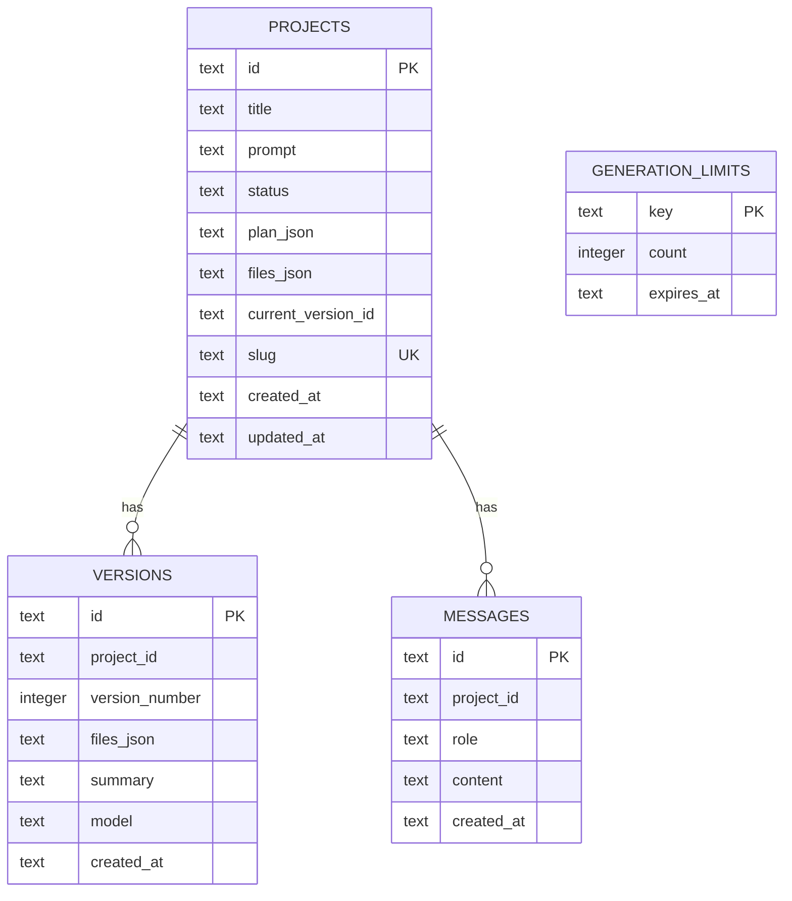
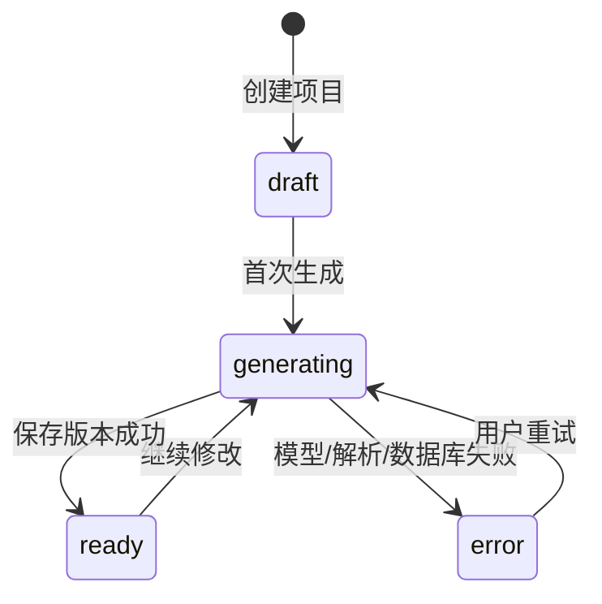

# 06. API、数据库与版本系统

## 1. API 总表

| 方法 | 路径 | 作用 | 主要返回 |
|---|---|---|---|
| GET | `/api/projects` | 最近 20 个项目 | `{ projects }` |
| POST | `/api/projects` | 创建 draft 项目 | `{ project }` |
| GET | `/api/projects/:id` | 读取一个项目和版本 | `{ project }` |
| POST | `/api/generate` | 生成或迭代 | NDJSON 事件流 |
| POST | `/api/projects/:id/restore` | 恢复一个快照 | `{ project }` |
| POST | `/api/projects/:id/publish` | 生成公开 slug | `{ project }` |

API 路由都只做薄编排：解析请求、检查字段、调用 `lib` 服务、把异常转换成 HTTP 响应。

## 2. 为什么先创建项目再生成

创建 `/api/projects` 只需要短事务：

- 生成 UUID；
- 插入 `projects`；
- 插入第一条 user message；
- 返回项目。

模型生成可能几十秒。如果把创建和生成绑在一次普通 JSON 请求里，页面在等待期间没有稳定 ID，也不利于重试和恢复。先得到 project ID，后续所有行为都围绕它进行。

## 3. 四张表



`projects.files_json` 是当前状态，`versions.files_json` 是历史快照。虽然有一定重复，但读取当前项目和恢复历史都非常直接。

## 4. D1 binding 是什么

部署平台把数据库实例以 `DB` 名称注入 Worker 环境。代码通过：

```ts
const binding = env.DB;
binding.prepare("SELECT ... WHERE id = ?")
  .bind(id)
  .first();
```

`?` 占位符和 `.bind()` 避免把用户输入拼进 SQL，从而降低 SQL 注入风险。

## 5. Schema 与 migration

- `db/schema.ts`：Drizzle 的 TypeScript schema，是开发时的数据模型声明；
- `drizzle/*.sql`：可部署、可追踪的数据库变更；
- `lib/db.ts` 的 `ensureSchema()`：运行期防御性创建表和索引。

`ensureSchema()` 把初始化 Promise 缓存在 Worker 实例中，避免同一实例每次请求都重复发建表 SQL；失败时清空缓存，下一次可以重试。

成熟企业系统通常由部署流水线在流量切换前执行 migration，不会把所有 migration 责任放在请求路径。当前双保险适合 Demo，但生产升级复杂表结构时应改为正式 migration gate。

## 6. 项目状态机



状态用于 UI 提示，不替代版本记录。真正的代码内容以 `files_json` 和 `versions` 为准。

## 7. 保存一个版本

`saveGeneration()` 的逻辑：

1. 查询当前版本数量，得到下一个 `versionNumber`；
2. 创建 `versionId`；
3. batch 插入 version 全量文件；
4. 更新 project 当前文件、计划、标题、状态和 currentVersionId；
5. 插入 assistant message；
6. 重新读取完整 project 返回给前端。

这些写操作放在 D1 batch 中，减少网络往返，也让相关操作更集中。

并发限制：`COUNT + 1` 在同一项目并发生成时可能得到相同版本号。当前 UI 禁止同页重复生成，但多个浏览器仍可能并发。企业版本应增加唯一约束、项目级锁、队列或原子计数器。

## 8. 为什么用全量快照

恢复版本只需：

```sql
UPDATE projects
SET files_json = <version.files_json>,
    current_version_id = <version.id>
WHERE id = <project.id>;
```

不用依次回放补丁，也不会因为中间差量损坏导致后续版本都无法恢复。三文件通常只有几十 KB，全量快照的空间成本在 Demo 阶段可接受。

注意：恢复旧版本不会删除新版本。用户可以恢复 v1，再恢复 v2。

## 9. 发布链接

发布时生成：

```text
<规范化标题>-<project-id前6位>
```

并写入唯一 `slug`。公开页根据 slug 读取项目当前文件并显示全屏预览。

当前发布语义是“链接永远展示项目当前版本”，不是把发布时版本冻结。企业产品需要明确选择：

- 浮动发布：项目更新后公开页自动更新；
- 固定发布：发布记录指向某个 versionId，可回滚和审计。

本项目采用前者以简化 Demo。

## 10. 匿名限流

公网站点会消耗模型套餐额度。生成接口选择客户端标识：

1. Cloudflare IP header；
2. 代理转发 IP；
3. 真实 IP header；
4. 最后退化为 User-Agent。

然后：

- 使用 SHA-256 哈希；
- 只取部分摘要，不保存明文 IP；
- 以小时组成 bucket key；
- 用 `INSERT ... ON CONFLICT DO UPDATE ... RETURNING count` 原子递增；
- 默认每小时最多 8 次；
- 返回 429 和 `Retry-After: 3600`。

这是成本保护，不是可靠身份认证。NAT 用户可能共享额度，攻击者也可能绕过。生产系统应基于登录用户、项目套餐、全局预算、WAF 和异常检测组合限流。

## 11. HTTP 错误码

| 状态码 | 含义 | 示例 |
|---|---|---|
| 200 | 请求成功 | 项目读取、流已建立 |
| 201 | 资源创建成功 | 创建项目 |
| 400 | 请求字段错误 | prompt 太短、JSON 格式错误 |
| 404 | 资源不存在 | 项目或版本不存在 |
| 429 | 超过限流 | 本小时生成次数耗尽 |
| 500 | 服务端异常 | D1 或未预期错误 |

生成过程中发生错误时，HTTP 可能已经是 200，因为响应流已开始。此时用 NDJSON 的 `{ "type": "error" }` 通知浏览器。

## 12. 官方延伸阅读

- [Cloudflare D1 Worker Binding API](https://developers.cloudflare.com/d1/worker-api/)
- [Cloudflare D1 migrations](https://developers.cloudflare.com/d1/reference/migrations/)
