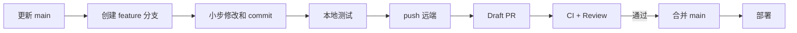

# 08. Git 与 GitHub：代码是怎么放上去的

## 1. Git 和 GitHub 不是一回事

- Git：本地版本控制工具，记录文件每次变化；
- GitHub：托管 Git 仓库、PR、Issue、Actions 和协作权限的网站；
- `origin`：本地仓库给某个远端地址起的默认名字；
- `main`：默认主分支；
- commit：一次带说明的不可变变更记录；
- push：把本地 commit 上传到远端；
- PR：请求把一个分支的变化合并到另一个分支。

网页部署也不是 GitHub 本身。本项目源码在 GitHub，运行环境在 Sites/Cloudflare Worker。

## 2. 首次建立本地仓库

典型命令是：

```powershell
git init
git add README.md package.json app components lib db drizzle
git commit -m "feat: deliver Nucleus AI app builder"
```

实际项目更早还有工程基线提交，随后分别提交功能、线上修复、验证记录和限流。当前历史可以查看：

```powershell
git log --oneline --decorate
```

为什么不把所有东西压成一个提交：每个 commit 对应一个可解释变化，出问题时可以定位、比较或回退。

## 3. 发布前怎样防止密钥入库

`.gitignore` 忽略：

```text
.env*
!.env.example
```

含义是忽略真实环境文件，但保留只写变量名、不写值的 `.env.example`。

发布前检查：

```powershell
git status --short
git diff --cached
git grep -n -E "(BEGIN.*PRIVATE KEY|sk-[A-Za-z0-9])" -- .
```

还要确认原始笔试 PDF、下载文件、构建产物和临时 token 不在 staged files 中。

注意：如果密钥已经进入任何 commit，仅加入 `.gitignore` 不够。应立即轮换密钥，再使用专业历史清理工具处理仓库历史。

## 4. GitHub 身份确认

本机使用 GitHub CLI：

```powershell
gh auth status
```

确认当前账号、Git 协议和 token 权限。终端可能显示 token 的掩码；不要把完整认证信息写进文档或提交。

## 5. 首次创建公开仓库的真实方式

项目使用类似下面的命令创建公开仓库、设置 `origin` 并推送：

```powershell
gh repo create lilongyong333/nucleus-ai-builder `
  --public `
  --source=. `
  --remote=origin `
  --push
```

参数含义：

- `--public`：公开可见；
- `--source=.`：用当前本地目录；
- `--remote=origin`：把新仓库登记为 origin；
- `--push`：立即上传当前分支历史。

远端地址是：

```text
https://github.com/lilongyong333/nucleus-ai-builder.git
```

检查关联：

```powershell
git remote -v
git status --short --branch
```

`main...origin/main` 表示本地主分支正在跟踪 GitHub 的主分支。

## 6. 为什么最初可以直接 push main

首次创建个人仓库时，需要先把一条已经验证的基线放到远端，因此直接 push main 是一种 bootstrap。仓库建立后，企业协作不应继续把日常修改直接堆到 main。

本次教学文档采用更规范的流程：

```powershell
git switch -c agent/teaching-guide
# 编辑文档
git add docs README.md
git commit -m "docs: add enterprise teaching guide"
git push -u origin agent/teaching-guide
gh pr create --draft --base main --head agent/teaching-guide
```

这样 GitHub 上能看到完整差异、检查结果和审查讨论，主分支在合并前保持稳定。

## 7. 一次正常功能开发的 Git 流程



命令示例：

```powershell
git switch main
git pull --ff-only origin main
git switch -c feat/project-ownership

# 修改后
git status --short
git diff
pnpm test
git add app lib db
git commit -m "feat: enforce project ownership"
git push -u origin feat/project-ownership
```

`--ff-only` 防止 pull 自动制造你没意识到的 merge commit。

## 8. Commit 怎么写

推荐格式：

```text
<type>: <一句命令式摘要>
```

常用 type：

- `feat`：用户可见新功能；
- `fix`：修复缺陷；
- `docs`：只改文档；
- `test`：测试；
- `refactor`：行为不变的重构；
- `chore`：构建、依赖、杂项。

一个 commit 应该能单独解释和审查。不要写“update”“改一下”“final final”。

## 9. PR 应写什么

一份合格 PR 描述包含：

- Summary：解决什么问题；
- Scope：改了哪些模块；
- Verification：执行了哪些测试；
- Risk：可能影响什么；
- Rollback：出问题如何撤回；
- Screenshots：有 UI 变化时附前后对比；
- Secrets/Data：是否涉及新环境变量或 migration。

Draft PR 表示“可以提前看，但还没准备好合并”。实现和自测完成后再标记 Ready for review。

## 10. 企业仓库应开启的保护

主分支建议配置：

- 必须通过 PR；
- 至少 1 名 reviewer 批准；
- 必须解决所有 review conversation；
- test/lint/typecheck/build 状态检查通过；
- 禁止 force push 和删除；
- 敏感目录使用 CODEOWNERS；
- 依赖更新和 secret scanning；
- 生产部署成功后才允许正式发布。

个人公开仓库也可以从最基本的“PR + CI”开始，不必一次配置完整企业治理。

## 11. GitHub 源码与部署源的关系

有两类远端不要混淆：

- GitHub `origin`：公开源代码，供阅读、协作和 PR；
- Sites 的内部部署源/版本：供托管平台构建和部署。

这次部署时把一个确定的 Git commit 交给部署系统，部署系统生成不可变站点版本。网页不是从你电脑持续运行的；电脑关机不影响线上站点。

## 12. 官方延伸阅读

- [GitHub：创建新仓库](https://docs.github.com/en/repositories/creating-and-managing-repositories/creating-a-new-repository)
- [GitHub：创建 Pull Request](https://docs.github.com/en/pull-requests/how-tos/create-pull-requests/creating-a-pull-request)
- [GitHub：保护主分支](https://docs.github.com/en/repositories/configuring-branches-and-merges-in-your-repository/managing-protected-branches/about-protected-branches)
- [Pro Git：分支原理](https://git-scm.com/book/en/v2/Git-Branching-Branches-in-a-Nutshell)
