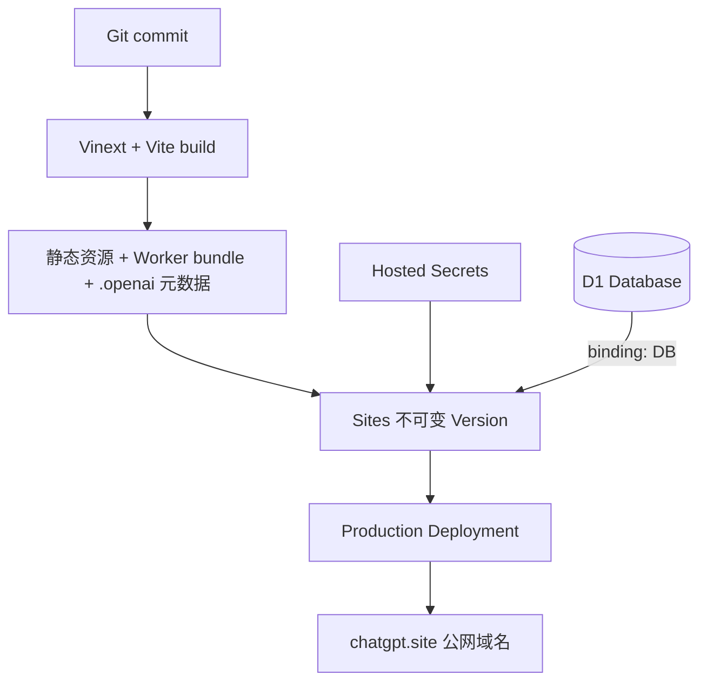

# 09. 部署与线上运维：网页端是怎么上线的

## 1. 这不是 GitHub Pages

GitHub Pages 适合纯静态文件。Nucleus 需要：

- 服务端读取 API Key；
- 服务端调用模型；
- D1 数据库；
- 动态 API 路由；
- 长时间生成请求和流式响应。

因此部署到能运行 Cloudflare Worker 和绑定 D1 的 Sites 环境。GitHub 负责托管源码，不负责本项目后端运行。

## 2. 部署架构



## 3. 第一步：让项目能构建为 Worker

普通 Next 构建产物不等于 Worker 产物。因此加入：

- `vinext`：App Router 到 Vite/Worker；
- `@cloudflare/vite-plugin`：本地 Workers runtime 和生产构建；
- `worker/index.ts`：请求入口；
- `vite.config.ts`：组合插件和本地 binding；
- `@cloudflare/workers-types`：D1 等 TypeScript 类型。

运行：

```powershell
pnpm build
```

成功后主要产物位于 `dist/`，包括服务端 Worker bundle 和静态资源。

## 4. 第二步：声明站点资源

`.openai/hosting.json` 保存：

- Sites project ID；
- D1 binding 名称 `DB`；
- 当前没有 R2 bucket。

这个文件可以提交，因为 project ID 是资源标识，不是认证凭据。API Key、部署 token 等不能写进去。

`vite.config.ts` 为本地 Cloudflare runtime 声明同名 `DB`，使代码在本地和云端都通过 `env.DB` 访问数据库。

## 5. 第三步：把 migration 带进部署包

自定义 `build/sites-vite-plugin.ts` 在构建结束时：

1. 创建 `dist/.openai`；
2. 复制 `hosting.json`；
3. 复制 `drizzle/` migration；
4. 删除上一次遗留的同名部署元数据。

如果漏掉这一步，应用代码可能部署成功，但平台不知道要绑定哪个 D1 或应用哪些数据库结构。

## 6. 第四步：配置云端环境变量

在托管环境设置：

```text
OPENCODE_GO_API_KEY      secret
OPENCODE_GO_BASE_URL     regular/secret config
OPENCODE_GO_MODEL        regular config
OPENCODE_GO_FALLBACK_MODEL regular config
OPENCODE_GO_CODE_MODEL regular config
OPENCODE_GO_CODE_FALLBACK_MODEL regular config
OPENCODE_GO_REQUEST_TIMEOUT_MS regular config
OPENCODE_GO_FALLBACK_RESERVE_MS regular config
OPENCODE_GO_CODE_REQUEST_TIMEOUT_MS regular config
OPENCODE_GO_CODE_FALLBACK_RESERVE_MS regular config
OPENCODE_GO_MAX_MODEL_CALLS regular config
OPENCODE_GO_MAX_TOTAL_TOKENS regular config
OPENCODE_GO_MAX_DURATION_MS regular config
OPENCODE_GO_STEP_MAX_CALLS regular config
OPENCODE_GO_STEP_MAX_TOTAL_TOKENS regular config
OPENCODE_GO_STEP_MAX_DURATION_MS regular config
OPENCODE_GO_IRIS_MAX_TOKENS regular config
OPENCODE_GO_BOB_MAX_TOKENS regular config
OPENCODE_GO_HTML_MAX_TOKENS regular config
OPENCODE_GO_CSS_MAX_TOKENS regular config
OPENCODE_GO_JS_MAX_TOKENS regular config
OPENCODE_GO_RAY_MAX_TOKENS regular config
OPENCODE_GO_REPAIR_MAX_TOKENS regular config
```

真实 Key 作为 hosted secret 保存，不进入 Git commit、构建日志、浏览器 bundle 或文档。

本地 `.env.local` 和云端 secret 是两份独立配置：本地能生成，不代表线上已配置；线上能生成，也不代表仓库里有 Key。

## 7. 第五步：创建站点和保存版本

实际发布流程通过 Codex 的 Sites 托管能力完成，大致是：

1. 创建或选择 Sites project；
2. 获得短期、受限的部署源凭据；
3. 将确定的 Git commit 推送给内部构建源；
4. 打包构建产物与 `.openai` 元数据；
5. 保存一个不可变 site version；
6. 让该 version 成为 production deployment；
7. 轮询部署状态直至成功；
8. 将站点设为公开访问；
9. 如果修改环境变量，部署一个使用新 environment revision 的 saved version。

短期凭据只通过单次命令的 HTTP header 使用，没有写入 Git remote 或配置文件。部署完成后，本地公开 `origin` 仍然是 GitHub。

## 8. “Version”和“Deployment”的区别

- Version：某一次确定的代码与构建产物；
- Deployment：让某个 Version 接收某个环境的真实流量。

分开后可以保存多个版本，只切换生产指针完成发布或回滚。不要把“又 build 一次”当作可靠回滚，因为依赖和外部状态可能已经变化。

## 9. 第六步：线上验收

部署显示 success 后仍要检查：

```text
GET  /                         -> 200
GET  /api/projects             -> 200，说明 Worker 和 D1 可用
POST /api/projects             -> 创建 draft
POST /api/runs                 -> 创建 runId，不在短请求中调用模型
POST /api/runs/:id/step        -> 每次收到当前阶段 NDJSON，循环到 complete
POST /api/projects/:id/publish -> 得到 slug
GET  /p/:slug                  -> 200，预览可交互
```

本项目最终已验证：

- 首页和 API 返回 200；
- D1 初始化/迁移可用；
- Sign in with ChatGPT、匿名迁移和账号项目中心可用；
- 复杂看板 21 秒、6,293 Tokens、1 次模型调用、11 个事件、Ray 100/A；
- 三文件齐全、启动校验通过并写入固定 v1；
- 新增、搜索、两次流转和统计更新可用；
- 四个公开页均返回 200；
- 浏览器断流能恢复/取消且不会重复 POST；
- 匿名限流可触发 429。

最终部署为 Sites version 16，环境 revision 3，commit：

```text
feccdf10ce462a94b070ae629241cb3110dd4aa4
```

自定义域名：<https://www.llynb.cc>

Sites 备用地址：<https://nucleus-ai-builder-root.dreamy-joy-4746.chatgpt.site>

`www.llynb.cc` 直接绑定现有 Sites 项目，而不是在 Railway 再部署一套应用。Cloudflare 中的 `www` 使用 DNS-only CNAME 指向 `custom-domains.chatgpt.site`，并通过 Sites 返回的两条 TXT 完成域名所有权与证书验证。详细步骤、故障判断和回滚见 [自定义域名与长期托管](../CUSTOM-DOMAIN-DEPLOYMENT.md)。

## 10. 线上问题怎么定位

| 症状 | 优先检查 |
|---|---|
| 首页 500 | Worker build、运行时兼容、环境绑定 |
| 项目 API 500 | `DB` binding、migration、D1 日志 |
| 生成 429 | 用户限流和 `Retry-After` |
| 生成立即 error | Key、模型 ID、套餐权限、端点协议 |
| 生成长时间无 complete | current_stage、最新 Artifact/ModelAttempt、active_step、单阶段/整轮预算 |
| 登录后看不到游客项目 | 身份头完整性、visitor Cookie、adoptVisitorProjects |
| 另一个账号能读项目 | 所有私有 SQL 是否同时带 owner_id（应立即阻断发布） |
| 公开页内容意外变化 | `published_version_id` 是否错误跟随 current version |
| 预览白屏 | 三文件内容、iframe 错误桥、浏览器 Console |
| 发布页 404 | slug 是否写入、路由参数、D1 环境是否正确 |

## 11. 回滚方案

### 代码回滚

把生产 deployment 指回上一成功 Version，或者对错误 commit 做 `git revert` 后重新走流水线。

### 数据库回滚

数据库回滚更谨慎。优先设计向后兼容 migration：先加字段、双读/双写、切代码、最后清理旧字段。不要在生产高峰直接执行不可逆删除列。

### 模型配置回滚

如果新模型质量/权限异常，将 `OPENCODE_GO_MODEL` 改回已验证模型并重新部署配置版本。

本项目真实发生过一次模型顺序回滚：Qwen 复杂代码输出超过长连接窗口，GLM 同题 21 秒完成，因此主备改为 GLM -> Qwen，并通过 environment revision 3 重新发布。

## 12. 发布后不能只看 HTTP 200

完整验收还要在有登录状态的浏览器里：

1. 创建项目；
2. 观察 Iris 0ms、Alex 模型与 Ray 质量；
3. 实际点击生成应用；
4. 展开审计核对耗时/Token/调用/事件；
5. 发布固定版本；
6. 在新标签打开公开页；
7. 打开账号中心核对工作台和成品完整 URL；
8. 重新打开 generating 项目，确认不会重复 POST；
9. 必要时取消遗留租约。

## 13. 企业环境应该增加什么

- preview/staging/production 三套环境；
- GitHub Actions 自动检查；
- PR preview URL；
- migration 独立审批和备份；
- Worker 日志、错误率、P95 延迟、模型成本仪表盘；
- 告警、值班和事故手册；
- secret rotation；
- 自定义域名、WAF、CSP；
- canary 或蓝绿发布；
- 自动回滚阈值。

## 14. 官方延伸阅读

- [Cloudflare Workers Vite plugin](https://developers.cloudflare.com/workers/vite-plugin/)
- [Cloudflare D1 Worker API](https://developers.cloudflare.com/d1/worker-api/)
