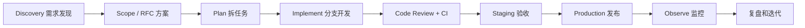

# 10. 按正常企业流程开发

## 1. 企业流程不是“开会更多”

核心目的只有四个：

- 做对需求；
- 降低线上风险；
- 让别人能接手；
- 出问题时能定位和恢复。

一个常见的端到端流程如下：



## 2. 阶段一：需求发现

### 输入

- 原始笔试 PDF；
- 交付时间；
- 可用的模型套餐和部署资源；
- 评审者最可能操作的路径。

### 产出

- 用户故事：非技术用户通过一句话得到可运行网页应用；
- 验收标准：创建、生成、预览、迭代、版本、发布、下载；
- 非功能要求：密钥隔离、在线可用、响应反馈、额度保护；
- 明确不做：任意后端/npm/容器、生成应用独立数据库、计费、团队协作；平台账号登录和私有项目后来纳入 P1 并完成。

### 企业角色

产品经理负责“为什么做、谁使用、什么算成功”；技术负责人负责“边界和风险”；设计师负责“流程与界面”。小项目里可以是同一个人，但思考维度不能省。

## 3. 阶段二：技术方案/RFC

方案评审至少回答：

- 生成物格式为什么是三文件；
- 为什么使用确定性 Iris SOP + 一次代码模型调用；
- 为什么用 D1 全量快照；
- 为什么用 sandbox iframe；
- 失败与超时如何反馈；
- Key 放在哪里；
- 如何部署和回滚；
- 成本上限是什么。

重大决策可以写 ADR（Architecture Decision Record）：背景、候选方案、决定、后果。当前 [架构文档](../DESIGN.md) 已记录主要取舍，企业项目可拆成多个带编号 ADR。

## 4. 阶段三：拆任务与估算

建议按可垂直验收的切片拆分：

| Epic | 子任务 | 完成证据 |
|---|---|---|
| 工程基线 | 框架、类型、样式、测试 | 本地 dev/build 通过 |
| 项目管理 | 创建/读取项目、D1 表 | 刷新后项目仍存在 |
| AI 生成 | Planner、Builder、解析 | 三文件非空可运行 |
| 工作台 | 流事件、预览、代码面板 | 用户看到实时过程 |
| 版本系统 | 快照、列表、恢复 | v1/v2 可互相恢复 |
| 交付 | 发布、ZIP、README | 公开链接和下载可用 |
| 上线 | Worker、D1、secret | 公网 E2E 成功 |
| 防护 | 限流、错误桥 | 429 和运行错误可见 |
| 身份 | visitor + ChatGPT 登录 + 迁移 | 两个会话隔离、同账号跨设备 |
| 并发 | generation 租约与取消 | 第二写者 409、旧写者不能落库 |
| 质量 | Ray 9 项门和定向修复 | 坏应用不创建 Version |
| 审计 | GenerationRun/AgentEvent | 成功/失败/取消都有终态 |

每个任务包含 acceptance criteria，避免“前端做完了，但 API 字段还没定”的假完成。

## 5. 阶段四：分支开发

标准步骤：

1. 从最新 `main` 创建短生命周期分支；
2. 一次只解决一个任务；
3. 小步 commit；
4. 本地测试；
5. push 后尽早开 Draft PR；
6. 根据 review 修改；
7. CI 全绿并获得批准；
8. 合并后自动部署到 staging/production。

分支命名示例：

```text
feat/model-repair
fix/iframe-storage
docs/teaching-guide
chore/upgrade-vinext
```

## 6. 阶段五：Code Review

Reviewer 不只看代码风格，应检查：

### 正确性

- 网络分块是否会打断 JSON；
- 模型缺文件时会怎样；
- D1 写入失败后状态是否一致；
- 版本号并发是否安全。

### 安全

- API Key 是否可能进入客户端；
- SQL 是否绑定参数；
- iframe 是否授予多余权限；
- 用户输入/模型输出是否有限制；
- 日志是否包含隐私或 secret。

### 可维护性

- 组件、API、模型、数据职责是否清晰；
- 是否有共享类型；
- 错误信息是否可操作；
- 新行为是否有测试和文档。

### 运维

- migration 是否向后兼容；
- 部署需要哪些变量；
- 出错如何回滚；
- 是否会突然增加模型费用。

## 7. 阶段六：CI

Pull Request 上建议自动运行：

```yaml
name: ci
on:
  pull_request:
  push:
    branches: [main]

jobs:
  verify:
    runs-on: ubuntu-latest
    steps:
      - uses: actions/checkout@v4
      - uses: pnpm/action-setup@v4
        with:
          version: 11
      - uses: actions/setup-node@v4
        with:
          node-version: 22
          cache: pnpm
      - run: pnpm install --frozen-lockfile
      - run: pnpm test
      - run: pnpm lint
      - run: pnpm exec tsc --noEmit
      - run: pnpm build
```

这是教学示例；生产仓库还要 pin action SHA、限制 workflow 权限、缓存审计、上传测试报告和做依赖/secret 扫描。

## 8. 阶段七：环境和发布

### 推荐环境

| 环境 | 数据 | Secret | 用途 |
|---|---|---|---|
| local | 本地 D1 | `.env.local` | 开发者调试 |
| preview | 临时/测试 D1 | preview secret | 每个 PR 验收 |
| staging | 独立 D1 | staging secret | 集成与业务验收 |
| production | 生产 D1 | production secret | 真实用户 |

禁止 staging 和 production 共用数据库或 Key，否则测试可能污染正式数据和额度。

### 发布检查

- 变更经过批准；
- CI 全绿；
- migration 已审核并备份；
- 环境变量齐全；
- rollback version 明确；
- 发布窗口和负责人明确；
- smoke test 清单准备好。

## 9. 阶段八：可观测性

至少监控：

- HTTP 请求量、4xx、5xx；
- 生成成功率；
- 模型响应 P50/P95/P99；
- 空返回、漏文件和 repair 比例；
- 每个模型 token/费用；
- D1 错误和延迟；
- 429 数量；
- 发布版本和错误率关联。

日志使用 request ID 串联浏览器请求、模型调用和 D1 写入，但不能记录 API Key、完整 IP、用户敏感 Prompt 或所有生成代码。

## 10. 事故处理

如果新版本上线后生成成功率骤降：

1. 确认影响范围和开始时间；
2. 冻结继续发布；
3. 对比新旧 Version、模型配置和外部提供商状态；
4. 优先回滚到上一稳定版本；
5. 必要时关闭生成功能，保留项目读取和公开页；
6. 通知相关人员；
7. 修复后做复盘，不只追责个人。

复盘应记录时间线、根因、为什么现有保护没发现、永久修复和负责人。

## 11. 当前项目与企业标准的差距

| 能力 | 当前 | 企业目标 |
|---|---|---|
| 分支/PR | `agent/metagpt-quality-gate` + Draft PR #2 | 所有日常变化必须 PR + reviewer |
| CI | GitHub Actions 跑 test/lint/type/build/Chromium E2E | required checks + 安全/依赖扫描 |
| 环境 | local + production | preview/staging/production |
| 用户 | 游客 + Sign in with ChatGPT、owner、匿名迁移、跨设备记忆 | RBAC、组织、团队空间、账号生命周期 |
| 数据 migration | SQL + 运行期防御初始化 | 部署前 migration gate |
| 监控 | 手工线上验收 | 指标、日志、追踪、告警 |
| 模型 | GLM/Qwen 主备、超时、调用/Token/时间预算、取消 | 多供应商熔断、成本路由、离线 eval |
| 安全 | sandbox、secret、限流、owner、质量门、审计 | CSP、WAF、内容审核、组织合规 |
| 发布 | 不可变版本，可手工回滚 | 自动化 canary/蓝绿 |

## 12. 这次项目实际是如何推进的

Git 历史反映了真实迭代：

1. 工程基线和核心产品；
2. 模型空返回、漏文件和传输协议修复；
3. 公网部署、源码和限流；
4. MetaGPT-inspired Ray 质量门；
5. owner、单写租约、取消和固定发布；
6. GenerationRun/AgentEvent 审计；
7. ChatGPT 登录、游客迁移、账号中心和对话记忆；
8. 主备模型、超时和共享预算；
9. iframe 启动校验、NDJSON 心跳和断流恢复；
10. 确定性 Iris、模型真实基准和四个固定 Demo；
11. 恢复遗漏的 `docs/learning`，升级到当前生产基线。

完整提交与故障因果见 [真实施工日志](00-how-we-got-here.md)。这比“最后一次性上传成品”更能说明工程过程。每个关键修复都来自可复现的本地或线上失败，并由自动测试或生产证据收口。

## 13. AI 工具在流程中的正确位置

AI 可以帮助：检索候选方案、生成初稿、解释代码、写测试、检查差异和整理文档。但负责人仍要：

- 确认需求和范围；
- 检查许可证和来源；
- 审查每个文件的行为；
- 运行真实验证；
- 保护 secret；
- 对最终交付负责。

本项目参考过开源 AI builder 的产品/架构概念，但核心实现按当前范围独立编写，没有把不理解的大型项目直接改名提交。面试时应如实说明 AI 协助范围。
